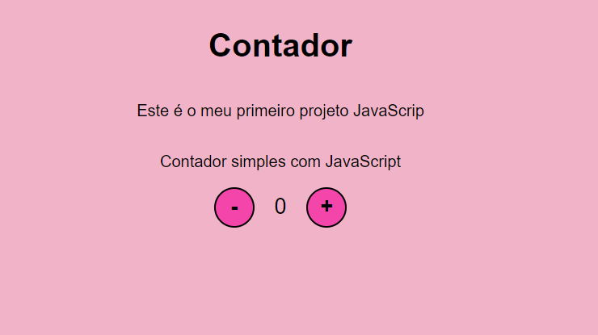

# Contador-JavaScript
## Contador Simples com Java

Esse projeto é um desafio do módulo JavaScript do Bootcamp Santander 💻♨️ 

Para o desenvolvimento desse projeto foram utilizados:
 - Visual Studio Code
 - Git
 - HTML
 - CSS
 - Flexbox
   
**Abaixo segue o layout do projeto:**

